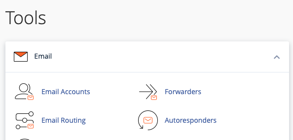
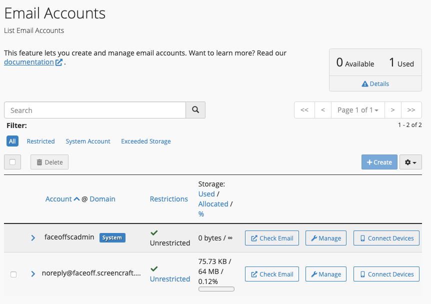
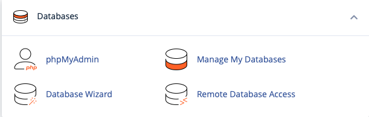
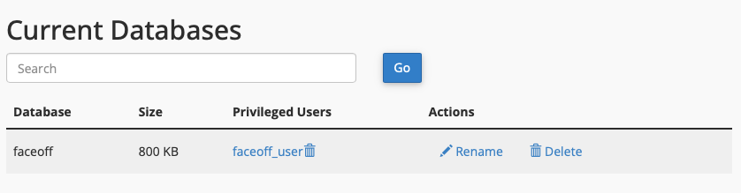
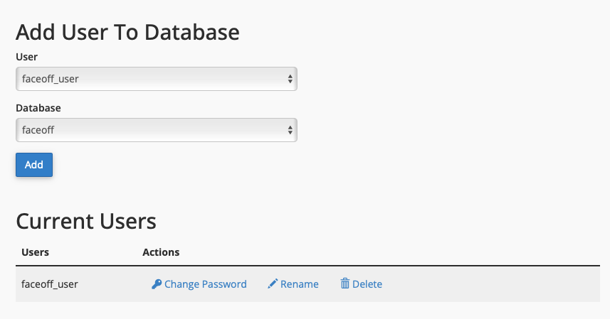
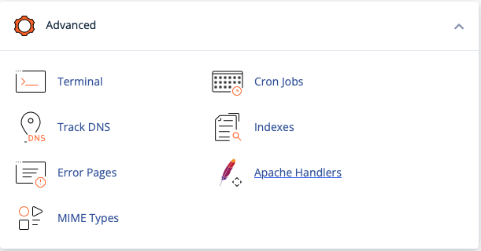
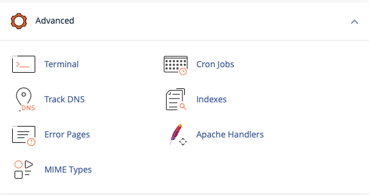
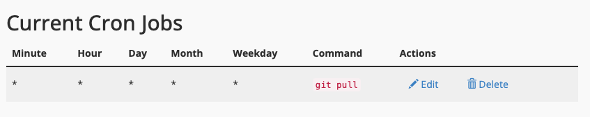
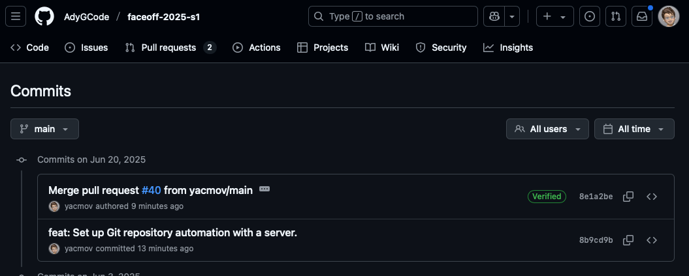
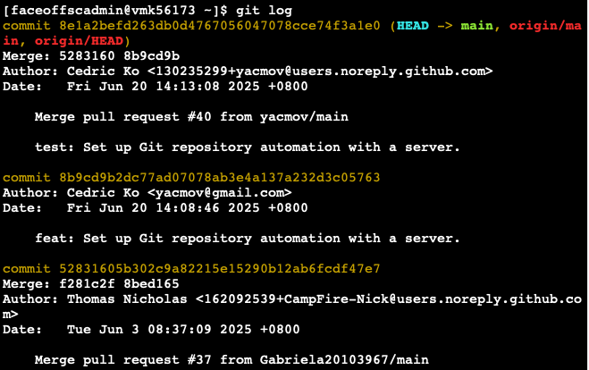

# Screencraft Hosting Details and Installation Guide

[BACK](README.md)

This document outlines the hosting details for the `faceoff.screencraft.net.au` project and provides information regarding its deployment and configuration.

## 1. Hosting Access
serverConfiguration
- **Domain:** `faceoff.screencraft.net.au`
- **Username:** Open upon request
- **Password:** Open upon request
- **cPanel URL:** `https://screencraft.net.au:2083`
- **API Endpoints (e.g.):**
    - https://faceoff.screencraft.net.au/api/v1/login
    - https://faceoff.screencraft.net.au/api/v1/auth/register


## 2. Email Setup

### 2.1. Email Account Connection for .env File

The following variables are used for configuring email in your Laravel .env file:

```md
MAIL_MAILER=smtp
MAIL_SCHEME=null
MAIL_HOST=mail.faceoff.screencraft.net.au
MAIL_PORT=465
MAIL_USERNAME=Open upon request
MAIL_PASSWORD=Open upon request
MAIL_FROM_ADDRESS=Open upon request
MAIL_FROM_NAME="${APP_NAME}"
```

## 2.2. Create Email Account with cPanel

### Use the cPanel interface to create your email accounts.





## 3. Database Setup

### 3.1. Database Connection for .env File

The following variables are used for configuring your database connection in the Laravel .env file:

```md
DB_CONNECTION=mysql
DB_HOST=127.0.0.1
DB_PORT=3306
DB_DATABASE=Open upon request
DB_USERNAME=Open upon request
DB_PASSWORD=Open upon request
```

### 3.2. Create Database with cPanel

Creating a dedicated database via cPanel is crucial for security, as it replaces insecure plain-text storage like SQLite.


- **Database Wizard**: Start by using the Database Wizard for a guided setup.



- **Current Databases**: View and manage your existing databases.


- **Add User to Database**: Ensure you connect the database user to the newly created database.


> [!NOTE]  
> For values marked "Open upon request," please contact the repository owner. If you have direct server access, you can find this information within the .env file.


## 4. Deployment

Follow these steps to deploy your Laravel project to the Screencraft server:

- **Access Terminal**: Navigate to the Terminal within your cPanel.


- **Clone Project**: Clone your Git repository into your root folder (e.g., $HOME/).

- **Remove** public_html: Delete the existing public_html directory.

- **Create Symbolic Link**: Run the following command to link your Laravel project's public directory to public_html:

```sh
ln -s $HOME/public public_html
```

This command creates a symbolic link, effectively making your Laravel project's public folder the document root for your website, ensuring correct routing for both cPanel and your Laravel application.


> [!IMPORTANT]  
> Shared hosting environments typically do not support npm. Therefore, you must run npm install and compile your assets (e.g., using `npm run build` or `npm run dev`) locally on your development machine, then upload the generated files (e.g., CSS, JavaScript) into the public folder on the server.


## 5. Automated Deployment

To streamline updates, automated deployments are configured using cPanel's Cron Jobs to monitor your Git repository.


- **Access Cron Jobs**: You can manage your scheduled tasks via Cron Jobs in cPanel.


- **Add New Cron Job**: Use the "Add New Cron Job" section to set up your deployment schedule.


The project targets your remote Git repository at 
`https://github.com/AdyGCode/faceoff-2025-s1`
 
The server will check for any pull requests approved into the main branch. We've already tested this with a pull request that was approved, and the server updated automatically. Once approved, the server will pull the updated code and deploy the latest version.

- **GitHub Approved Pull Request Example:**


- **Cron Job Test Output:**
